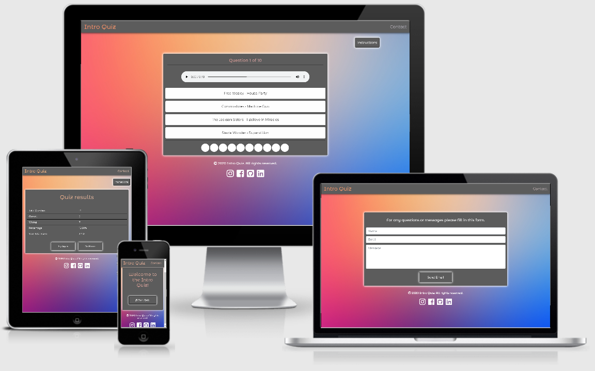

<h1 align="center">Intro Quiz (ms2)</h1>

[Go to the project here.](https://lonneke-dev.github.io/ms2/)

This is my second project with CodeInstitute to show my skills with HTML5, CSS3 and JavaScript.

<h4></h4> 

Intro Quiz is a multiple choice music game where the user listens to a short intro and needs to choose an answer from the options.

## User Experience (UX)

-   ### User stories

    -   #### First Time Visitor Goals

        1. As a First Time Visitor, I want to easily understand the game I'm about to play.
        2. As a First Time Visitor, I want to be able to easily navigate throughout the site to find content.
        3. As a First Time Visitor, I want to get the resutls after playing the game.

    -   #### Returning Visitor Goals

        1. As a Returning Visitor, I want to play again without having the same songs.
        2. As a Returning Visitor, I want to find the best way to get in to contact so I could ask questions and get more information.

    -   #### Frequent User Goals
        1. As a Frequent User, I want contact the person behind the project.

-   ### Design
    -   #### Colour Scheme
        -   The background is a beautiful picture from [dribble.com](https://dribbble.com/shots/1576433-16-Free-Blurry-Backgrounds).
        -   The colours chosen for the texts and backgrounds of the elements are all quite neutral because of the colourful background
        -   The colours used are: a shade of grey rgb(92, 92, 92), black #000 and white #fff.
    -   #### Typography
        -   The Montserrat Alternates font is used throughout the whole website for headings.
        -   The Montserrat is used throughout the whole website for all the paragraphs as a nice contrast for the headings. 
        -   The Sans Serif fotn is the fallback font in case for any reason the font isn't being imported into the site correctly. 
        -   All fonts are easy to read for the users.

*   ### Wireframes

    -   [See all Wireframes here](assets/mockups/ms2.pdf)

    -   All wireframes were made with [Balsamiq](https://balsamiq.com/)

## Features

-   All features are responsive on all device sizes

    -   Navigation/menu bar 
        * Allows users to go to the contact page and back to the main screen.
    -   Instructions buttons
        * Allows the user to get instructions on how to play the game.
    -   Main screen
        * Allows the user to start the game when they want to.
    -   Quiz section 
        * Allows the user to listen to a song and choose an option while also keeping track of the question being answered wrong or right.
    -   Results section
        * Allows the user to know how well they did after playing the game.
    -   Social media links 
        * Allows users to go to the person's social media platforms so that they can see more and/or come into contact, by clicking on the links in the footer.
    -   Email form 
        * Allows users to come into direct contact with me, by filling in the form the developer will get a message.

-   Interactive elements
    -   All the buttons and links on the site have a hover over style to make clear to users that they're clickable.
    -   The instructions button pops up a modal so the user can always check out the instructions while playing.
    -   The question counter keeps track of what song you're on whilst playing.
    -   After choosing an option it immediately shows wether it's correct or not.
    -   The next button only shows up after answering the question.
    -   After answering the question the answer indicator will keep track of the questions being answered correctly or not whilst playing.
    -   The results will be shown after answering all the questions. There you'll be able to find how many questions the user answered correct, wrong, the percentage of correct answers and the user's total score.
    -   The contact form will send an email to the developer directly.
    -   If an email is send with the contact form the user will get a message saying an email has been send.
    -   If an error occurs with sending an email with the contact form the user will get a messsage saying an error occurred and the option to try again.
    -   The links in the footer have a hover over style aswell.

## Future Features

-   Three different difficulties in the game.
-   A broughter range of songs for the quiz.
-   Multiple different kinds of games all concernign music. 
-   A list with all the songs used in the quiz with links to the songs.

## Technologies Used

### Languages Used

-   [HTML5:](https://en.wikipedia.org/wiki/HTML5) Used to structurize and design the layout and content of the website.
-   [CSS3:](https://en.wikipedia.org/wiki/Cascading_Style_Sheets) Used to style the website and create some of the responsiveness and interactive elements.
-   [JavaScript](https://nl.wikipedia.org/wiki/JavaScript) Used for almost every interactive feature on the website.

### Frameworks, Libraries & Programs Used

1. [Bootstrap 4.5.0:](https://getbootstrap.com/docs/4.5/getting-started/introduction/)
    - Bootstrap was used to help with the layout and responsiveness of the website, it was also used to make the navbar.
2. [Google Fonts:](https://fonts.google.com/)
    - Google fonts were used to import the 'Montserrat and Montserrat Alternates' fonts into the style.css file which is used throughout the project.
3. [Font Awesome:](https://fontawesome.com/)
    - Font Awesome was used to add icons.
4. [Git](https://git-scm.com/)
    - Git was used for version control by utilizing the Gitpod terminal to commit to Git and Push to GitHub.
5. [GitHub:](https://github.com/)
    - GitHub is used to store the projects code after being pushed from Git.
6. [Balsamiq:](https://balsamiq.com/)
    - Balsamiq was used to create the [wireframes](assets/mockups/mockups-ms1.pdf) during the design process.
7. [Audiotrimmer:](https://audiotrimmer.com/)
    - Audiotrimer was used to shorten the audio files. To make sure only the intro is played, which is different for every song.
8. [EmailJS:](https://www.emailjs.com/)
    - EmailJS was used to connect the contact form to the developers email.

## Testing

All testing information can be found in a this separate file: [TESTING.md](TESTING.md) 

### Known Bugs

-   Currently there aren't any bugs that needs to be fixed.

### Fixed Bugs

-   The full length of the array was shown whilst playing the game: by changing all the quiz.length to 10 the problem was solved.


## Deployment

### GitHub Pages

The project was deployed to GitHub Pages using the following steps...

1. Log in to GitHub and locate the [GitHub Repository](https://github.com/)
2. At the top of the Repository (not top of page), locate the "Settings" Button on the menu.
    - Alternatively Click [Here](https://raw.githubusercontent.com/) for a GIF demonstrating the process starting from Step 2.
3. Scroll down the Settings page until you locate the "GitHub Pages" Section.
4. Under "Source", click the dropdown called "None" and select "Master Branch".
5. The page will automatically refresh.
6. Scroll back down through the page to locate the now published site [link](https://github.com) in the "GitHub Pages" section.

### Forking the GitHub Repository

By forking the GitHub Repository we make a copy of the original repository on our GitHub account to view and/or make changes without affecting the original repository by using the following steps...

1. Log in to GitHub and locate the [GitHub Repository](https://github.com/)
2. At the top of the Repository (not top of page) just above the "Settings" Button on the menu, locate the "Fork" Button.
3. You should now have a copy of the original repository in your GitHub account.

### Making a Local Clone

1. Log in to GitHub and locate the [GitHub Repository](https://github.com/)
2. Under the repository name, click "Clone or download".
3. To clone the repository using HTTPS, under "Clone with HTTPS", copy the link.
4. Open Git Bash
5. Change the current working directory to the location where you want the cloned directory to be made.
6. Type `git clone`, and then paste the URL you copied in Step 3.

```
$ git clone https://github.com/lonneke-dev/ms1
```

7. Press Enter. Your local clone will be created.

```
$ git clone https://github.com/lonneke-dev/ms1
> Cloning into `CI-Clone`...
> remote: Counting objects: 10, done.
> remote: Compressing objects: 100% (8/8), done.
> remove: Total 10 (delta 1), reused 10 (delta 1)
> Unpacking objects: 100% (10/10), done.
```

Click [Here](https://help.github.com/en/github/creating-cloning-and-archiving-repositories/cloning-a-repository#cloning-a-repository-to-github-desktop) to retrieve pictures for some of the buttons and more detailed explanations of the above process.

## Credits

### Code

-   [Codeinstitute](https://codeinstitute.net/): For teaching me the basics and making it possible to do this project.

-   [Fontawesome](https://fontawesome.com/): Used for the icons in the navbar and the social media links in the footer.

-   [Bootstrap4](https://getbootstrap.com/docs/4.4/getting-started/introduction/): Bootstrap Library used throughout the project mainly to make site responsive using the Bootstrap Grid System.

-   [W3schools](https://www.w3schools.com/): Used to help with finding the right names and attributes.

-   [Simple JavaScript Quiz](https://www.youtube.com/watch?v=88UESQT5q6A): For helping me create the quiz with JavaScript.

-   [Transparent Text](https://codepen.io/AdamGrayson/pen/VPMzoW): For the background effect on most of the titles.

### Content

-   All audio is downloaded with a youtube converter and I don't own any of it.

-   All other content is written by the developer (me).

### Media

-   The background image was retrieved from a free sample at [dribble.com](https://dribbble.com/shots/1576433-16-Free-Blurry-Backgrounds).

### Acknowledgements

-   My Mentor for giving me feedback and support.

-   Student Care at [Code Institute](https://codeinstitute.net/) for keeping me motivated.

-   The code institute [slack](https://slack.com/intl/en-nl/) community for helping me out with small problems like finding the right attribute etc.

-   My parents for supporting me throughout the project.