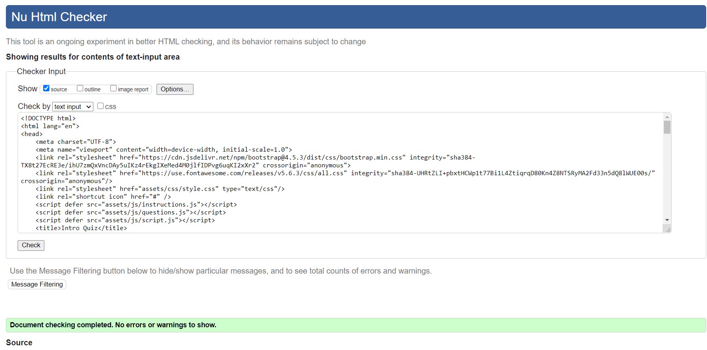
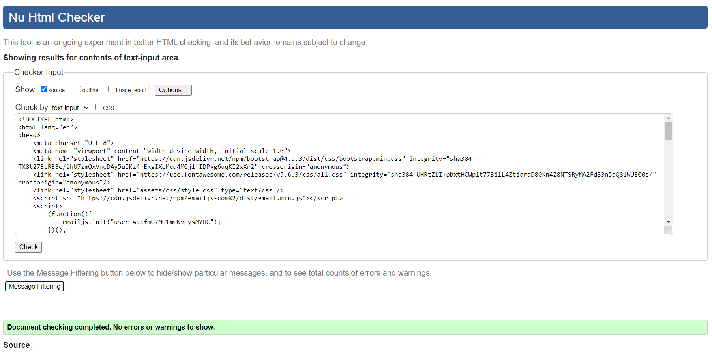
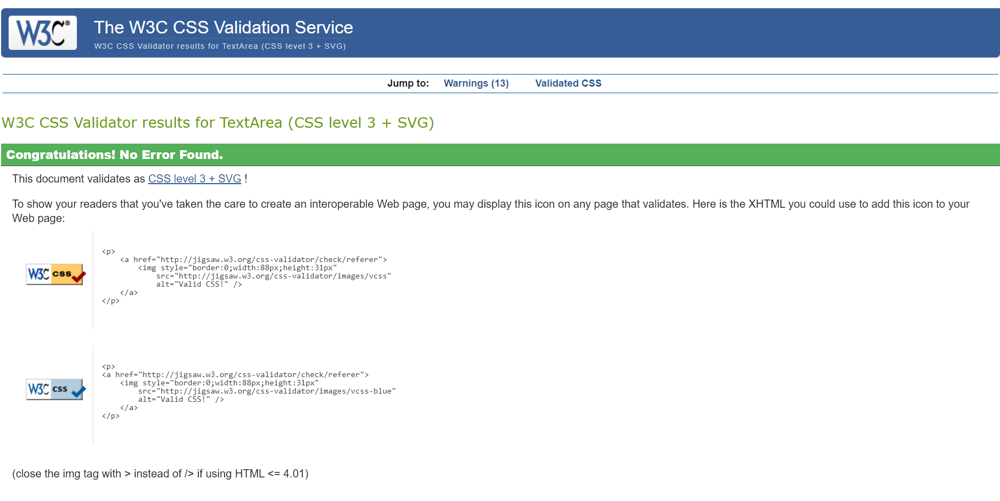
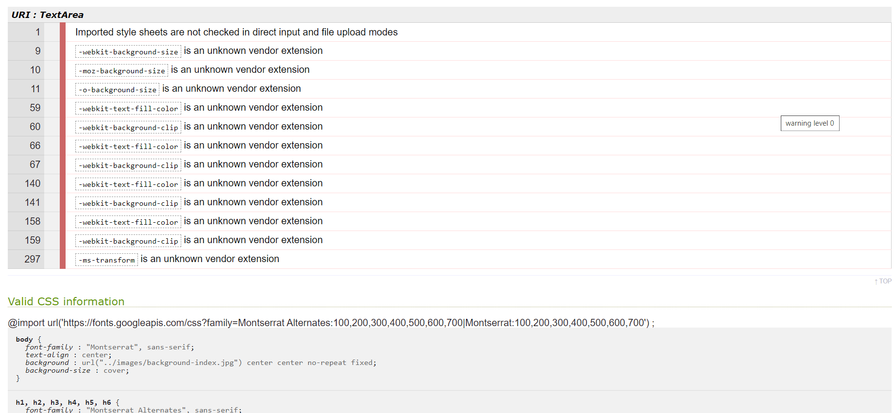
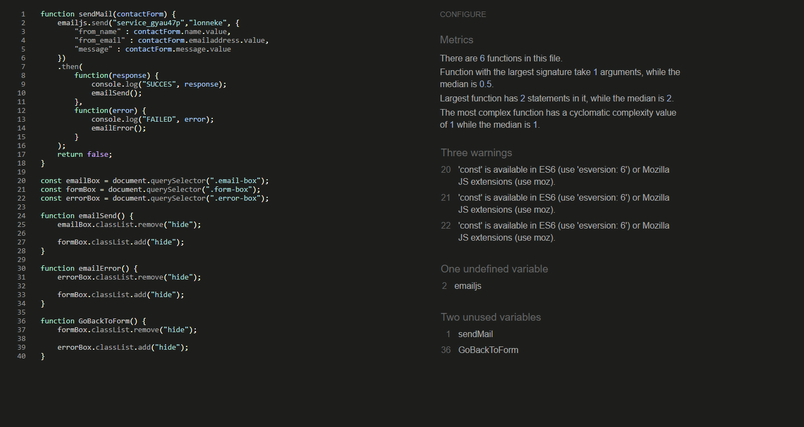
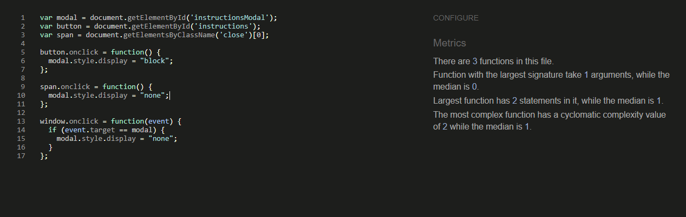
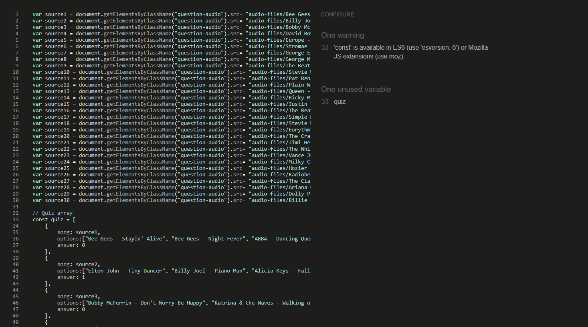
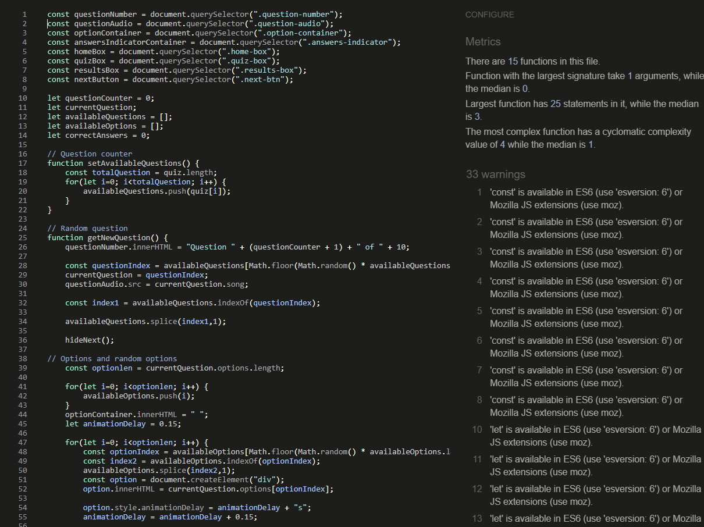

# Testing

The W3C Markup Validator and W3C CSS Validator Services were used to validate every page of the project to ensure there were no syntax errors in the project.
To test the JavaScript code JSHint validator was used to make sure there weren't any bugs in the code itself.

-   [W3C Markup Validator](https://validator.w3.org/#validate_by_input)
    
    - The validation of the index page:

    

    - The validation of the contact page:

    

-   [W3C CSS Validator](https://jigsaw.w3.org/css-validator/#validate_by_input) 
    
    - The validation of the css file.

    
    

    - The warnings shown by css are not recognised by the css validator but are used for the different browsers, so not relevant to change.

-   [JSHint](https://jshint.com/)

    - The validation of email.js.

    

    - The unused variable in the email.js file are used as a button onclick function, so they are used outside of the JavaScript file.

    - The validation of instructions.js.

    

    - The validation of questions.js.

    

    - The unused quiz variable is used in the script.js file, but to keep from cluttering the script.js file I have separated the complete file in to 2.

    - The validation of script.js.

    

## Testing User Stories

-   #### First Time Visitor Goals

    1. As a First Time Visitor, I want to easily understand the game I'm about to play.

        1. When the user first arrives the name of the website and the icon used in the start button will implicate something with music. 
        2. By clicking on the instructions button at the top of the page the user will be able to easily understand the game their about to play.

    2. As a First Time Visitor, I want to be able to easily be able to navigate throughout the site to find content.

        1. By using the nav bar to go back to the index page and the separate contact page the user should have no issues with this.
        2. The buttons implemented throughout the site will help the user to go from and to specific parts too.

    3. As a First Time Visitor, I want to get the resutls after playing the game.
        
        1. After the user has finsished the game a result box will appear which holds all the information collected while the user played.

    4. As a First Time Visitor, I want to pause and play the audio whenever I want.

        1. With the audio controls used in the HTML the user can easily pause and play audio.

-   #### Returning Visitor Goals

    1. As a Returning Visitor, I want to play again without having the same songs.

        1. The questions provided are all selected randomly so the user won't get used to the same questions.
        2. The quiz array holds 30 different questions and only 10 are selected so the user will have a different experience everytime the user returns.

    2. As a Returning Visitor, I want to find the best way to get in to contact so I could ask questions and get more information.

        1. The users can easily go the contact section by using the contact link in the navbar.
        2. Here they can fill out the form to send a direct message. 
        3. The footer contains social media links leading to my own accounts on facebook instagram and more.
        4. Whichever link they click, it will be open up in a new tab to ensure the user can easily get back to the website.

-   #### Frequent User Goals

    1. As a Frequent User, I want contact the person behind the project.

        1. By using the contact form the user can send the developer an email directly.
        2. The social media links in the bottom will also provide the option to contact the developer.

## Further Testing

-   The Website was tested on multiple browsers and a variety of devices
-   A large amount of testing was done on responsiveness, functionality and interactivity.